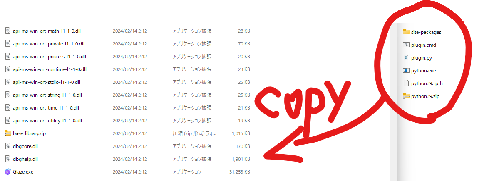
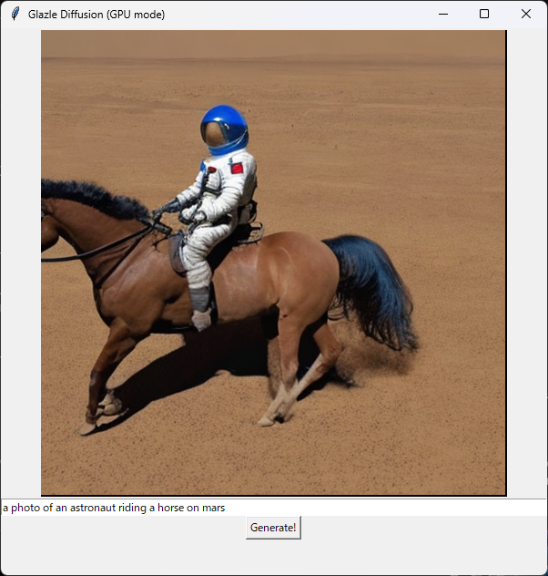

# Glazle Diffusion
Super light-weight AI image generator based on Glaze.
If you are already using Glaze, just download and paste the files and it works!

# Note
- Windows Only
- AMD64 Only
- NVIDIA GPU support
- Tested on Glaze 1.1.1

# How to Use
0. Install Glaze. Make sure it works.
1. Download zip from the [release](https://github.com/Yosshi999/GlazleDiffusion/releases) page.
2. Unzip it. And copy them into Glaze folder.

3. Doubleclick `plugin.cmd`
4. Enjoy!

# FAQ
## No!!
Glazle Diffusion does not scrape/copy/train on your art. It works perfectly fine in offline mode. Install, turn off wifi, then run.